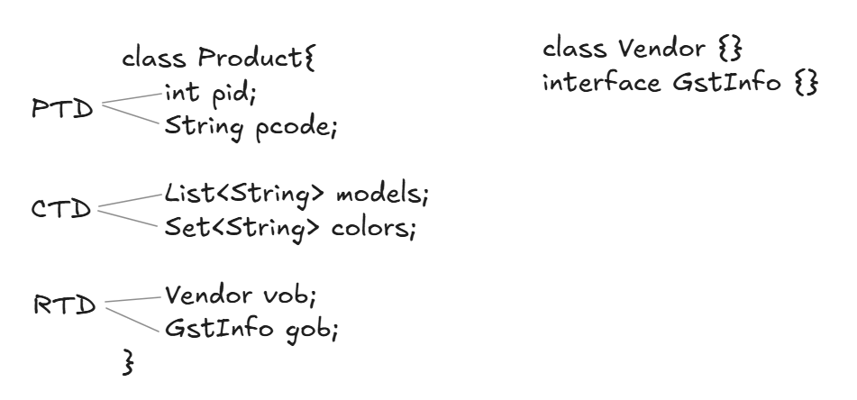
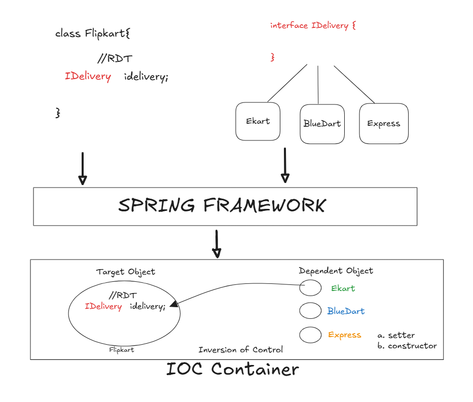
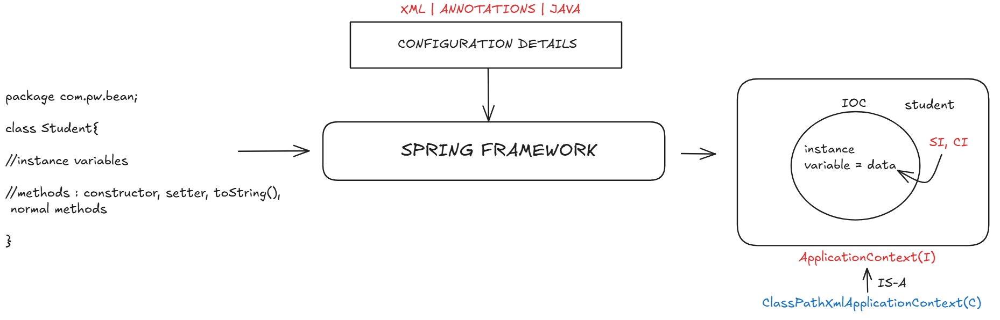
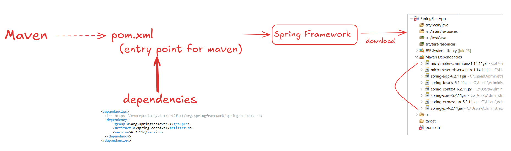
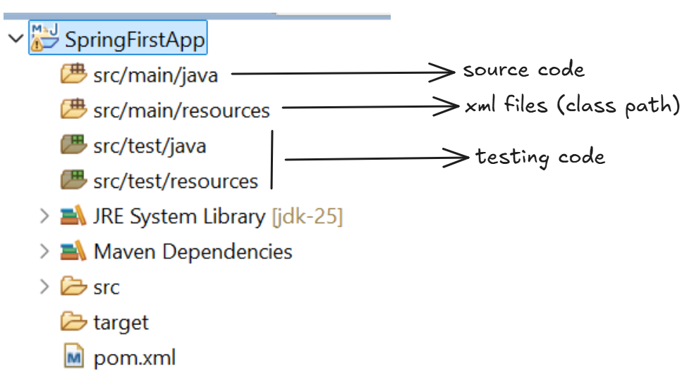
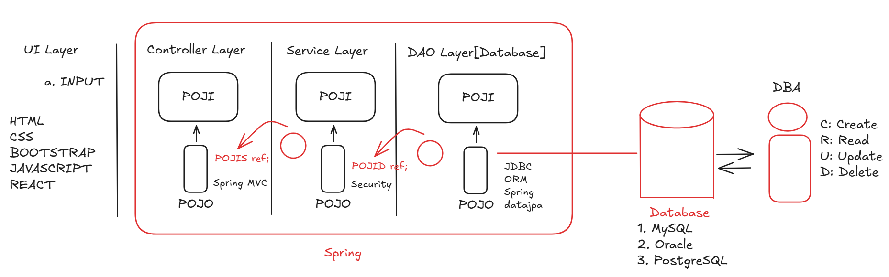
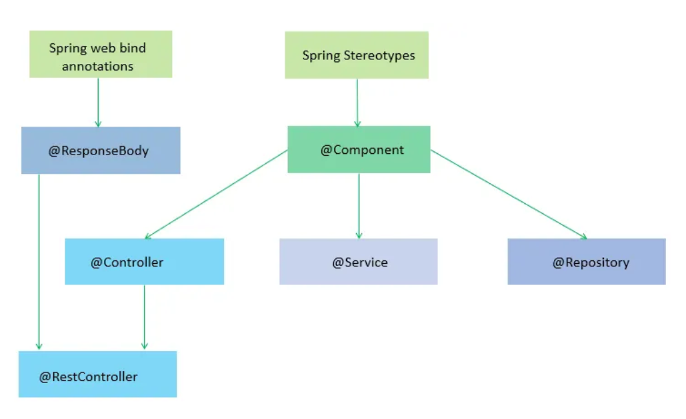

# Prerequisites for Learning Spring Framework

## Core Java
- OOPs Concepts
  - Encapsulation
  - Inheritance
  - Polymorphism
  - Abstraction
- Exception Handling
- Multithreading
- Collections
  - List
  - Set
  - Map
  - Properties

## Advanced Java
- JDBC
- Web Applications
  - Servlet
  - JSP

## Frameworks
- Hibernate
- Spring
- Spring Boot

## Tools
- Build Tools
  - Maven
  - Gradle

## Spring Basics
- Spring Core
  - Inversion of Control (IoC)
  - Dependency Injection (DI)

# Basics of SB


```java
class Student{
    //instance variable
    //methods : constructor, setter and getters, normal methods
}


Student s = new Student();
```

*) Dependency: A variable (instance variable) exist inside a class (Spring Bean)

=> Types of Dependencies: (3)
1. **Primitive Type Dependency (PTD) [8+1]** :
byte, short, int, long, float, double, boolean, char and `String`. If a variable is created using one of above datatype then it is called as PTD.

1. **Collection Type Dependency (CTD) [4] (java.util)** :
If a variable is created using one of below types
List, Set, Map (I) and Properties (C) then it is called as CTD.

1. **Reference Type Dependency (RTD)** :
A class or interface is used as a DataType and variable is created then it is called as RTD.


>Example:

---



> The process of injecting Dependable object to Target object is referred as `DI`.

### Role of IOC Container
1. Scans for the Bean.
2. Creates the Object.
3. Provide data to the variables or link the object.
4. Destroy the Object.
   


# Rules for Writing a Bean (Class) in Spring

1. public class (must be)
2. class should be in a package. </br>
   [must be in base package or sub-package].
3. variables recommended to be private.</br>
   Methods need to be public only.
4. Provide default constructor with mutators</br>
   (setter/getter methods)</br>
   [or]</br>
   Parameterized constructor</br>
   (Even both are also valid)</br>
5. Our class can have Object class methods overridden. toString(), equals() and hashCode().
   
6. class can inherit (extends / implements ) other valid Spring Beans only.</br>
   But not Servlets/EJB ... (other external APIS) 
* Spring Beans can implement java.io.Serializable (I)
1. Annotations: (can be)</br>
*) Core Annotations (java.lang package)</br>
*) ---- Spring F/W Annotation</br>
*) Integrations (JPA/....)




### ================XML Configuration================
\<bean> --- creating object<br>
\<property> --- calling set method<br>
\<constructor-arg> --- calling parameterized constructor<br>
\<value> --- Primitive<br>
\<list> \<set> \<map> \<props> --- for collections<br>
\<ref/> --- link objects


> Solid Principles always follow `POJI`(Plain Old Java Interface) or `POJO`(Plain Old Java Object). <br>
> It(application or class or interface) should be open for extension and close for modification.



### Working with p:namespace and c:namespace

syntax:
```
    <bean ... p:variable="" />
    <bean ... p:variable-ref="" />
    <bean ... c:variable="" />
    <bean ... c:variable-ref="" />
```
Alternative:
```
  <bean ... c:_0-ref="" c:_1-ref=""/>

         _0       _1
  Order(Product, Customer)
```

---

## Limitations of XML
1. Difficult for the java developers to learn xml and configure the container.
2. Difficult to track the namespace used to get the configuration setup clearly.
3. Wrong syntax of xml will never start the code[so container won't create an object].<br>

Solution : use Annotations or Pure Java Configurations.

---

### Spring Annotations:-
1. StereoType Annotations :
   Annotation that indicates creating object to spring bean.

A) @Component     : creating object<br>
B) @Repository    : creating object + Database Operations<br>
C) @Service       : creating object + Business Logics/cal/Tx Management<br>
D) @Controller    : creating object + HTTP Operations (WEB MVC)<br>
E) @RestController: creating object + HTTP (Restful Webservices)<br>



eg#1:
```
package com.pw.dto;

@Component
public class Employee{

}

Reference : employee
```

eg#2:
```
package com.pw.dto;

@Component("emp")
public class Employee{

      @Value("10")
      private Integer eid;

}

Reference : emp
```
---

#### IOC Container:
- a. It accepts two inputs
  - a. Spring Bean
  - b. Configuration Details [ XML | Annotations | Pure Java ]
- b. It manages the life cycle of an object.
<br>

---

#### Configure the Container using XML

1. `<bean id='' class=''>`  
2. `<property name='' value='' ref=''>`  
3. `<constructor-arg name='' value='' ref=''>`  
4. Using namespace also we can perform **DI: Setter and Constructor**

---

#### Configuring the Container using Annotations

1. `@Component`  
2. `@Controller`  
3. `@Service`  
4. `@Repository`  
5. `@Configuration`  
6. `@ComponentScan`  
7. `@Value`  
8. `@Autowired`  
9. `@Primary`  
10. `@Qualifier`  
11. `@PostConstruct`
