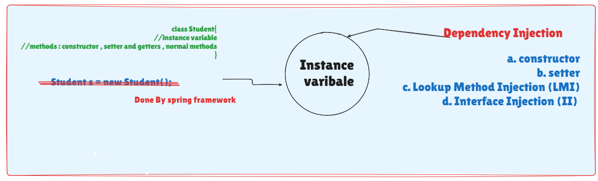

# Prerequisites for Learning Spring Framework

## Core Java
- OOPs Concepts
  - Encapsulation
  - Inheritance
  - Polymorphism
  - Abstraction
- Exception Handling
- Multithreading
- Collections
  - List
  - Set
  - Map
  - Properties

## Advanced Java
- JDBC
- Web Applications
  - Servlet
  - JSP

## Frameworks
- Hibernate
- Spring
- Spring Boot

## Tools
- Build Tools
  - Maven
  - Gradle

## Spring Basics
- Spring Core
  - Inversion of Control (IoC)
  - Dependency Injection (DI)

# Basics of SB



```java
class Student{
//instance variable
//methods : constructor , setter and getters , normal methods
}
```

Student s = new Student();

Types of Dependencies

PDT [8 + 1 (String)]  -> Primitive DATATYPE

CDT [4]  -> Collection DATATYPE

RDT -> Reference DATATYPE

```java
class product {

int pid;

String pcode;

List<Sting> models;    Set<String> colors;    Vendor vob;    GstInfo gob;

}
```

interface Vendor{}

class GstInfo{}

## What is Dependency Injection
*) Dependency: A variable (instance variable) exist inside a class (Spring Bean)

=> Types of Dependencies: (3)
1. **Primitive Type Dependency (PTD) [8+1]** :
byte, short, int, long, float, double, boolean, char and String If a variable is created using one of above datatype then it is called as PTD.

2. **Collection Type Dependency (CTD) [4] (java.util)** :
If a variable is created using one of below types
List, Set, Map (I) and Properties (C) then it is called as CTD.

3. **Reference Type Dependency (RTD)** :
A class or interface is used as a DataType and variable is created then it is called as RTD.